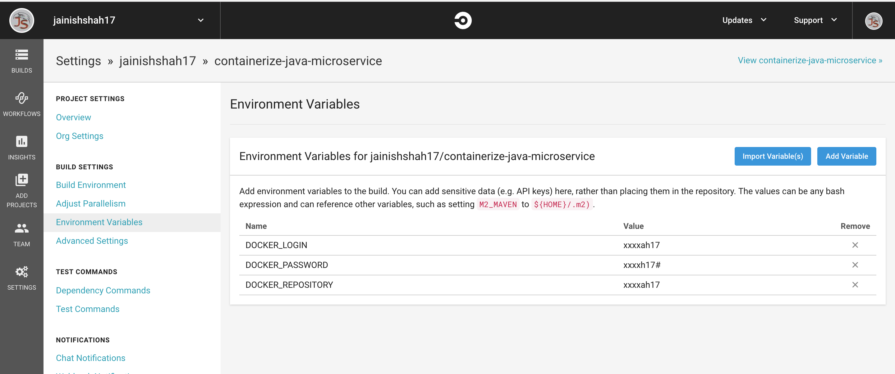
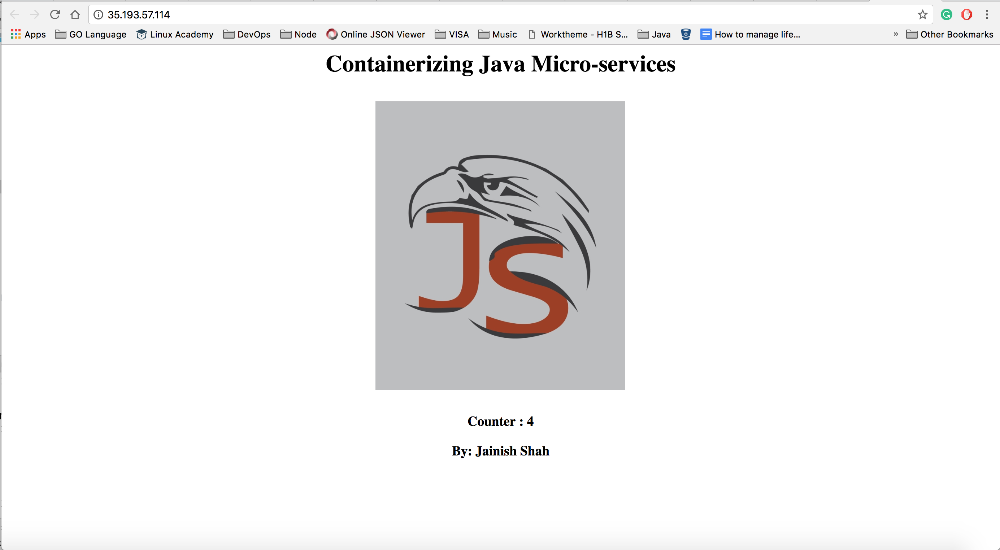

# Containerize Java Microservices using CircleCI


`To make this integration work you will need to have running Artifactory-Enterprise/Artifactory-pro/Artifactory SAAS.`

#### Command to test maven project:    
```
## Test Java WebApplication 
mvn test
## Test and build Java WebApplication  
mvn clean install
```

#### Command to build docker image and push it to docker registry:


*   Build docker image: ```docker build -t $DOCKER_REGISTRY/java-webapp .```
*   Run docker container: ```docker run -d -p 8080:8080 $DOCKER_REGISTRY/java-webapp```
*   Test container accessing application in browser [http://localhost:8080/](http://localhost:8080/)
*   Login to Artifactory docker registry: ```docker login -u $USER -p $PASSWORD $DOCKER_REGISTRY```
*   Push docker image: ```docker push $DOCKER_REGISTRY/java-webapp```

### Steps to build docker images using CircleCI and push it to docker registry.

##### Step 1:

copy `.circleci/config.yml` to your project

##### Step 2:

Add your project in Circle CI.

##### Step 3:

add Environment Variables `$DOCKER_REGISTRY`, `USER`, `PASSWORD` in Environment Variables settings of Circle CI.

```
$DOCKER_REGISTRY ->  Docker Registry URL 
e.g  $DOCKER_REGISTRY -> https://mycompany.docker.io/

USER -> Docker Registry User which has permission to deploy artifacts.
e.g USER -> admin

PASSWORD -> Password for Docker Registry User.
e.g PASSWORD -> password

```



##### Step 4:

You should be able to see published Docker image in Docker Registry.

