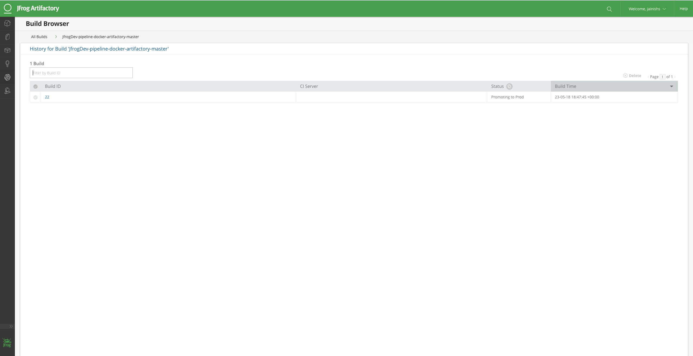

# Artifactory Integration with Bitbucket Pipeline

`To make this integration work you will need to have running Artifactory-Enterprise/Artifactory-pro/Artifactory SAAS.`

#### Command to test maven project:    
```
## Test Java WebApplication 
mvn test
## Test and build Java WebApplication  
mvn clean install
```

#### Command to build docker image and push it to Artifactory:


*   Build docker image: ```docker build -t $ARTIFACTORY_DOCKER_REPOSITORY/java-webapp .```
*   Run docker container: ```docker run -d -p 8080:8080 $ARTIFACTORY_DOCKER_REPOSITORY/java-webapp```
*   Test container accessing application in browser [http://localhost:8080/](http://localhost:8080/)
*   Login to Artifactory docker registry: ```docker login -u ARTIFACTORY_USER -p $ARTIFACTORY_PASSWORD $ARTIFACTORY_DOCKER_REPOSITORY```
*   Push docker image: ```docker push $ARTIFACTORY_DOCKER_REPOSITORY/node-version```

### Steps to build docker images using Bitbucket pipeline and push it to Artifactory.

##### Step 1:

copy `bitbucke-pipeline.yml` to your project

##### Step 2:

Enable your project in Bitbucket Pipeline.

##### Step 3:

add Environment Variables `ARTIFACTORY_URL`, `ARTIFACTORY_USER`, `ARTIFACTORY_DOCKER_REPOSITORY`, `ARTIFACTORY_PASSWORD`, `MVN_REPO`, `DOCEKR_STAGE_REPO`, `DOCEKR_PROD_REPO` and `DISTRIBUTION_REPO` in Environment Variables settings of Bitbucket Pipeline.
In this example `$ARTIFACTORY_DOCKER_REPOSITORY=jfrogtraining-docker-dev.jfrog.io`

```
ARTIFACTORY_URL ->  Artifactory URL 
e.g  ARTIFACTORY_URL -> https://mycompany.jforg.io/mycompany

ARTIFACTORY_USER -> Artifactory User which has permission to deploy artifacts.
e.g ARTIFACTORY_USER -> admin

ARTIFACTORY_PASSWORD -> Password for Artifactory User.
e.g ARTIFACTORY_PASSWORD -> password

ARTIFACTORY_DOCKER_REPOSITORY -> Artifactory docker registry to download and push Artifacts.
e.g ARTIFACTORY_DOCKER_REPOSITORY -> docker 

MVN_REPO -> Artifactory NPM registry to download and push artifacts.
e.g MVN_REPO -> libs-release

DOCEKR_STAGE_REPO -> Artifactory docker registry to push artifacts.
e.g DOCEKR_STAGE_REPO -> docker-stage-local

DOCEKR_PROD_REPO -> Artifactory docker registry to push artifacts.
e.g DOCEKR_PROD_REPO -> docker-prod-local 

DISTRIBUTION_REPO -> Artifactory distribution repository to push artifacts to Bintray.
e.g DISTRIBUTION_REPO -> pipeline-distribution
```


##### Step 4:

You should be able to see published Docker image in Artifactory.


Also Build information.


## Note: `This solution only supports Artifactory with valid ssl as Bitbucket Pipeline does not support insecure docker registry `
